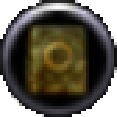
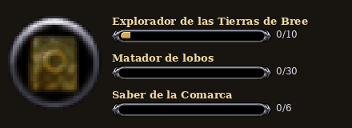
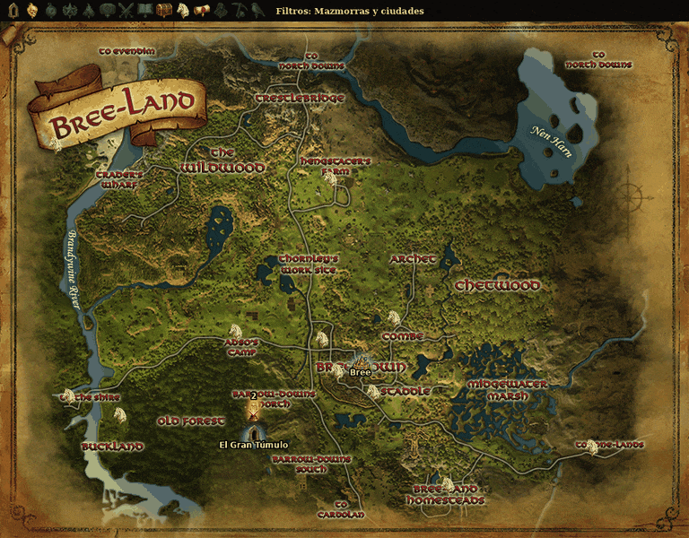

# 🏆 Deed Tracker (en español)

Seguimiento de **hazañas** para **The Lord of the Rings Online** con toda la base de datos **en español**.

---

## 1. Progreso de hazañas por zona

- Lista de las hazañas de cada zona: **exploración, matanza, saber, objetos** y más.
- **Barra de progreso** de cada una que avanza mientras juegas (lee los avisos del chat).
- **Recompensas** de cada hazaña: experiencia de virtud, puntos LOTRO.
- **Importa** el progreso desde LotroCompanion.

---

## 2. Hazañas en el Mapa del Mundo

El **Mapa del Mundo** lee el progreso de Deed Tracker y marca en cada zona dónde están los objetivos:

- **Con aura**: hazañas activas.
- **En gris con X**: completadas (o se ocultan, según prefieras).

