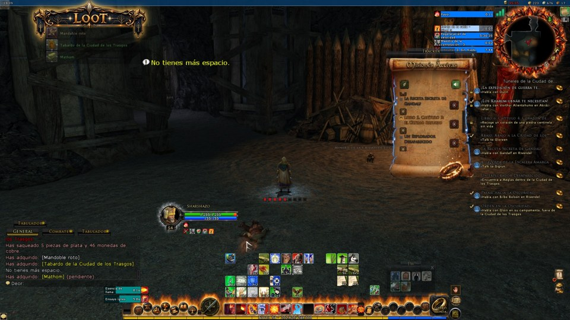
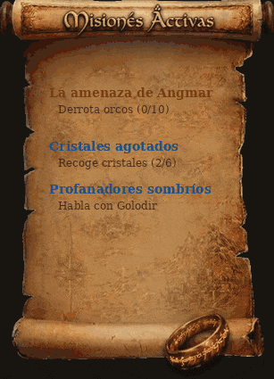
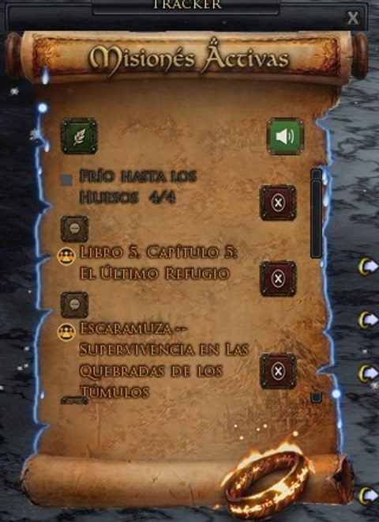
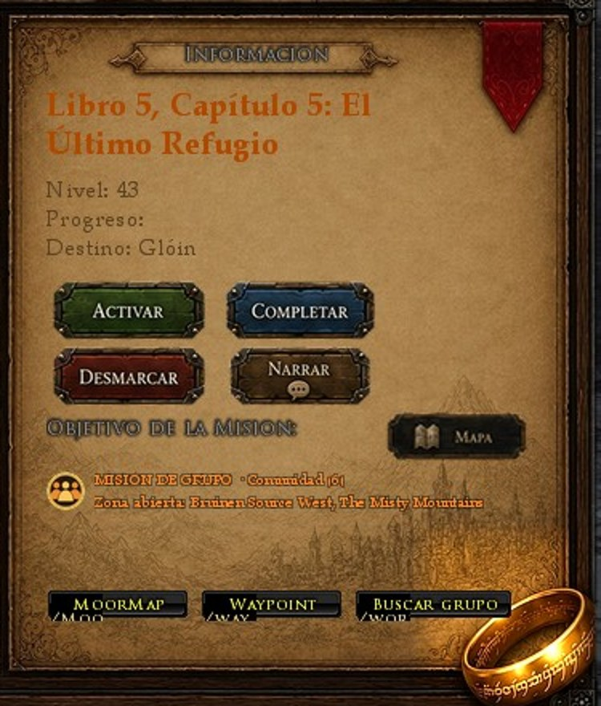

# 📖 QuestSync (LOTRO Quest Assistant)

Asistente de misiones **en español** para **The Lord of the Rings Online**: traduce el nombre, el diálogo y los objetivos de **más de 14.000 misiones** a partir de una base de datos propia, extraída y verificada. **No es traducción automática en vivo.** Incluye tracker flotante, libro de misión estilo pergamino, buscador, mapa y rutas, ayudas de recolección y narración por voz.

Nombre en el gestor de plugins: **QuestSync**



---

## Índice

1. [Cómo funciona](#1-cómo-funciona)
2. [Libro de misión](#2-libro-de-misión)
3. [Tracker de misiones activas](#3-tracker-de-misiones-activas)
4. [Ventana principal QuestSync](#4-ventana-principal-questsync)
5. [Misiones de grupo](#5-misiones-de-grupo)
6. [Mapa y rutas (MoorMap / Waypoint)](#6-mapa-y-rutas-moormap--waypoint)
7. [Recolección y cofres](#7-recolección-y-cofres)
8. [Narración por voz](#8-narración-por-voz)
9. [Idioma ES / EN](#9-idioma-es--en)
10. [Comandos](#comandos)
11. [Opciones y guardado](#opciones-y-guardado)
12. [Conexión con los otros addons](#conexión-con-los-otros-addons)
13. [Instalación](#instalación)
14. [Requisitos, limitaciones y créditos](#requisitos-limitaciones-y-créditos)

---

## 1. Cómo funciona

QuestSync lee el **chat de misiones** en tiempo real y detecta cuándo **aceptas, avanzas, completas o abandonas** una misión («Nueva misión: …», «Completado: …», contadores «(3/8)», «Misión abandonada: …»…). Con eso busca la misión en su base de datos (por nombre en español o inglés, o por el texto del objetivo) y la muestra **traducida**.

- Si dos misiones tienen el mismo nombre, elige solo cuando está seguro: descarta las que tu personaje no puede aceptar por nivel y usa la zona actual (aviso del canal Regional). Si sigue habiendo dudas, **no adivina**.
- Las hazañas también dicen «Completado:» en el chat; QuestSync las distingue para no confundirlas con misiones.
- Lo que no puede reconocer queda anotado para revisarlo con `/qsdiag`.

---

## 2. Libro de misión

**Para qué sirve:** leer la misión entera, en español, en cuanto la aceptas o la terminas.

**Cómo funciona:** al **aceptar o completar** una misión se abre un **libro estilo pergamino** con el nombre de la misión, todo el **diálogo traducido** y sus **objetivos**. El anillo del libro tiene **fuego animado** y hace una llamarada al aceptar o completar. Tiene botón **Narrar** para escucharla. En las misiones de grupo muestra el logo de grupo junto al título y una fila con el lugar y el tamaño del grupo.


---

## 3. Tracker de misiones activas

**Para qué sirve:** tener siempre a la vista lo que te queda por hacer en la zona.

**Cómo funciona:** ventana pequeña flotante y redimensionable con **todas tus misiones activas de la zona actual**:
- Nombre, **contador de objetivos** que avanza en vivo hasta «¡Completada!» y botón **Ir**.
- **Colores por tipo** (principal, grupo, repetible); las de grupo llevan su logo.
- Botón para **ocultar** cada misión.
- También muestra, con una insignia violeta, las **hazañas en curso de Deed Tracker**.
- Al entrar en el juego arranca en la zona donde lo dejaste, para no llenarse de misiones viejas de otras zonas.
- **Efectos de fuego:** la inscripción del anillo arde, una lengua de fuego recorre el título cada pocos segundos y los bordes tienen fuego élfico azul; llamarada de 3 s al aceptar o completar. Se apagan con `/trackerfuego off`.





---

## 4. Ventana principal QuestSync

**Para qué sirve:** consultar cualquier misión, punto de interés o colección.

**Cómo se usa:** `/questsync` (o `/qs`) o el icono flotante. Ventana redimensionable con pestañas:
- **QuestSync (misiones):** lista agrupada por área y zona, plegable, y panel de detalle con nivel, objetivos, estado y botones de mapa y ruta. Arriba, una banda fija con la misión activa o seguida, su progreso y el botón **Ir**.
- **Buscador:** por nombre (español o inglés) o por texto de objetivo, entre todas las misiones; muestra el área de cada resultado y hasta 200 resultados (con aviso si hay más).
- **Puntos de Interés** (cacerías de tesoro y cofres), **Tropas y Amenazas** (jefes itinerantes con nombre) y **Colecciones**.
- **Colores de estado:** beige = disponible, azul claro = activa, verde = completada.
- **Etiquetas:** «Diaria», «Semanal» o «Quincenal» en las misiones con bloqueo oficial, y una **franja verde** a la izquierda en las misiones apropiadas para tu nivel.
- **Botones** para activar, completar, desmarcar y **narrar** una misión.
- Al pasar el ratón por una misión sale una **ficha** con su nivel, su área y sus objetivos reales.
- El título grande tiene estrellas que titilan y el anillo arde, igual que el del tracker.



---

## 5. Misiones de grupo

- Las **1.448 misiones de grupo** (mazmorras, incursiones, instancias) tienen **color propio**, **logo de grupo** y un cartel que dice **a qué mazmorra o incursión hay que ir** y el tamaño oficial (grupo pequeño de 3, comunidad de 6, incursión de 12+).
- El nombre del lugar sale en **español y en inglés** (por ejemplo *La Decimosexta Sala (The Sixteenth Hall)*).
- **Filtro de grupo** junto al buscador: muestra solo misiones de grupo.
- Botón **Buscar grupo**: escribe en el chat un mensaje para buscar grupo con el lugar, el tamaño y el nombre de la misión. Solo se envía al hacer clic.

---

## 6. Mapa y rutas (MoorMap / Waypoint)

- Botones **Mapa** y **Ruta** en cada misión: abren **MoorMap** con el marcador en el lugar del objetivo o ponen la **flecha de Waypoint** hacia él, sin escribir nada.
- Si la misión tiene varios lugares conocidos, se ve el **desglose por etapa**.
- LOTRO no deja a un addon escribir comandos por código, así que cada botón lleva detrás un atajo invisible con el comando exacto: por eso al pasar el ratón el juego muestra su ficha «ALIAS: …».

---

## 7. Recolección y cofres

- **Ventana Recolección** (`/recoleccion` o la lupa del lanzador): eliges profesión y zona y ves el **mapa real de esa zona** (el mismo de MoorMap) con un icono por cada **punto de recolección guardado**. La ventana se redimensiona y el mapa se mueve arrastrándolo.
- Cuando el juego detecta un nodo de recolección aparece un **botón** para guardar ese punto con un clic.
- **Cofres y colecciones:** puedes marcarlos como **encontrados**; el Mapa del Mundo también lo tiene en cuenta.

---

## 8. Narración por voz

- Botón **Narrar** en el libro y en la ventana principal para escuchar la misión en voz alta.
- Botón de **silenciar / activar** (verde = encendido).
- Necesita el programa aparte [**Narrador_IA**](https://github.com/sharshazo/Narrador_IA) corriendo en tu PC (LOTRO no deja que un addon reproduzca sonido). Sin él, QuestSync funciona igual, solo sin voz.

---

## 9. Idioma ES / EN

Botón **ES/EN** en la ventana principal para ver las misiones en español o en inglés. El Mapa del Mundo usa ese mismo botón para el idioma de su panel de filtros.

---

## Comandos

| Comando | Qué hace |
|---|---|
| `/questsync` o `/qs` | Abre o cierra la ventana principal. |
| `/cofres` o `/qcofres` | Abre la ventana principal en la pestaña Puntos de Interés. |
| `/recoleccion` o `/qrecoleccion` | Abre o cierra la ventana Recolección. |
| `/trackerfuego on` · `/trackerfuego off` | Enciende o apaga los efectos de fuego del tracker, el libro y la ventana. |
| `/qsdiag` · `/qsdiag borrar` | Muestra los mensajes de misión que no se pudieron reconocer (con zona y nivel) · los borra. |

---

## Opciones y guardado

| Qué | Dónde |
|---|---|
| Estado de las misiones (activas, completadas, seguida), zona del tracker y efectos de fuego | Por personaje |
| Idioma ES/EN | Por personaje |
| Posición del icono flotante y si está bloqueado | Por personaje |
| Puntos de recolección guardados | Por personaje |
| Cofres y colecciones encontrados | Por personaje |
| Registro de `/qsdiag` (máximo 40) | Por personaje |
| Silencio de la narración | Por cuenta |

---

## Conexión con los otros addons

- **Mapa del Mundo:** lee tus misiones activas, sus objetivos y sus lugares y las marca con flechas y auras; QuestSync le avisa al aceptar, completar o abandonar. Con el mapa cargado, el libro y la lupa de QuestSync se abren desde el icono del mapa.
- **Deed Tracker:** comparten el mismo gancho del chat, y el tracker muestra las hazañas en curso de Deed Tracker.
- **LUI:** su cartel de misiones usa los mismos avisos del chat.
- **MoorMap y Waypoint:** se usan para el mapa y la flecha de ruta.

---

## Instalación

1. Copia las carpetas `LOTRO_Quest_Assistant` y `Turbine` dentro de:
   ```
   Documentos\The Lord of the Rings Online\Plugins\
   ```
2. Abre LOTRO → **Opciones → Plugins** (o `/pluginmanager`) y carga **QuestSync**, o escribe `/plugins load QuestSync`.

Con esto ya tienes el tracker, el libro, el mapa y la traducción funcionando.

### Narración por voz (opcional)

Los botones de narrar y silenciar necesitan una pieza aparte corriendo en tu PC (LOTRO no permite reproducir audio desde un addon). Es gratis, con un instalador de un clic:

- [**Narrador_IA**](https://github.com/sharshazo/Narrador_IA): la app que sintetiza y reproduce la voz (`Instalar.bat`, sin conocimientos de programación).

---

## Requisitos, limitaciones y créditos

**Requisitos**
- La carpeta `Turbine` dentro de `Plugins`.
- Opcional: **MoorMap** y **Waypoint** (botones Mapa y Ruta), **Narrador_IA** (voz).

**Limitaciones conocidas**
- La detección depende de los avisos del chat: si el juego no avisa, QuestSync no se entera.
- Si dos misiones con el mismo nombre siguen empatadas después de los filtros, no se activa ninguna.
- Al pasar el ratón por los botones Mapa y Ruta el juego muestra su ficha «ALIAS: …» (no se puede evitar).
- Algunas coordenadas de subzonas no encajan en el mapa general de MoorMap.

**Créditos**
- Integra datos de referencia de **Compendium**, **LotroCompanion / lotro-data** y **MoorMap / Waypoint** (addons de terceros que se instalan aparte).
- Las colecciones salen de **LostLore** y los cofres de **WarbandsSlayer**.
- El gancho de chat compartido y la ficha flotante siguen el diseño de **Deed Tracker** (de Cube).
