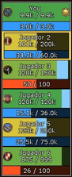
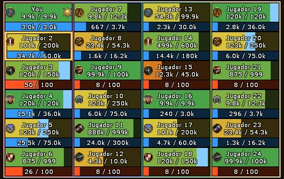

<p align="center"></p>

# ✨ LUI (en español)

Interfaz personalizada para **The Lord of the Rings Online**: marcos de combate más limpios, texto y bordes nítidos y control total de posición, colores, fuentes, umbrales y escala. Esta versión está en español y añade **efectos visuales hechos a medida**: carteles animados de misión y de zona, aura del puntero, ventana de botín con cartel «LOOT», auras en los marcos de grupo e incursión y más.

Versión: **2.3.0** · Basado en el [LUI original de Geldahr](https://github.com/Geldahr/LUI) (MPL-2.0).

---

## Índice

1. [Cartel al aceptar o completar una misión](#1-cartel-al-aceptar-o-completar-una-misión)
2. [Cartel al entrar en una zona](#2-cartel-al-entrar-en-una-zona)
3. [Auras del puntero del ratón](#3-auras-del-puntero-del-ratón)
4. [Ventana de botín](#4-ventana-de-botín)
5. [Marcos de grupo (party)](#5-marcos-de-grupo-party)
6. [Marcos de incursión (raid)](#6-marcos-de-incursión-raid)
7. [Buscador de objetos (Enciclopedia)](#7-buscador-de-objetos-enciclopedia)
8. [Aura del minimapa y aura de la barra](#8-aura-del-minimapa-y-aura-de-la-barra)
9. [Más herramientas de LUI](#9-más-herramientas-de-lui)
10. [Comandos](#comandos)
11. [Opciones y guardado](#opciones-y-guardado)
12. [Conexión con los otros addons](#conexión-con-los-otros-addons)
13. [Instalación](#instalación)
14. [Requisitos, limitaciones y créditos](#requisitos-limitaciones-y-créditos)
15. [README original de LUI (inglés)](#readme-original-de-lui-inglés)

---

## 1. Cartel al aceptar o completar una misión

**Para qué sirve:** ver al momento qué misión acabas de aceptar o terminar.

**Cómo funciona:** arriba en el centro de la pantalla, sobre la barra de estado, aparece un **cartel animado** con el **título de la misión** al aceptarla y con «Completado» al terminarla. Detecta los mismos avisos del chat que usa QuestSync («Nueva misión: …», «Completado: …»).

**Detalles:**
- El **estilo cambia según la región** de la misión: general, Comarca, élfico, Arnor, hielo, sombra, enano, Rohan, Gondor, tierras salvajes y sur (**11 estilos**).
- El cartel **se alarga** por el medio (de 380 a 1020 px) para que el título entre entero sin deformar los adornos.
- Tiene **aura**, un **destello** que lo recorre y **chispas** que titilan.
- Si aceptas varias misiones seguidas, los carteles **hacen cola** y salen uno tras otro.
- «Completado:» también lo usa el juego para las hazañas: el cartel solo sale si el nombre es de una misión.
- Se enciende o se apaga en **Opciones → Barra de estado → Cartel de misiones**. Prueba: `/lui cartel`.


---

## 2. Cartel al entrar en una zona

**Para qué sirve:** ver el nombre de la zona en la que estás.

**Cómo funciona:** al entrar en una región el juego te une al canal «<Zona> - Regional» y lo avisa en el chat; LUI usa ese aviso de **entrada** para mostrar el **nombre de la zona** en un cartel con el **estilo de su región** (los mismos 11 estilos), con aura, destello y chispas, y desaparece suavemente.

**Opciones:** mostrar el cartel, tamaño (300, 380 o 460 px), teñir la barra con el color del cartel y activar o no las animaciones. La última zona se guarda por personaje para que al entrar ya haya algo que mostrar.


---

## 3. Auras del puntero del ratón

**Para qué sirve:** no perder nunca el puntero en combate.

**Cómo funciona:** un **efecto animado** sigue al ratón. No cambia la flecha del juego y **no toma los clics**: pasan al juego como siempre. Al girar la cámara con el clic derecho el efecto se queda donde estaba el puntero, y al soltar la flecha vuelve a aparecer dentro.

**Opciones:**
- **7 estilos:** anillo, halo, esferas, fuego, runas, mira y estela (la estela deja un rastro de luz detrás del ratón).
- **6 colores:** dorado, azul, verde, rojo, morado y blanco.
- **3 tamaños**, opacidad y velocidad.
- **Siempre** o **solo al mover** el ratón.
- **Agitar para encontrar:** si agitas el ratón sale un destello grande.
- Se esconde con la interfaz (F12).
- Comando: `/lui puntero` (`on`, `off`, un estilo, un color o `prueba`).


---

## 4. Ventana de botín

**Para qué sirve:** ver lo que recoges de un vistazo.

**Cómo funciona:** cada objeto que recoges entra en la **ventana de botín** con su icono, su nombre en el **color de su calidad** (común, poco común, raro, incomparable, legendario) y la cantidad. Las filas aparecen una tras otra y se desvanecen solas. Al pasar el ratón por una fila sale la información normal del objeto.

**Detalles:**
- Encima va el **cartel «LOOT»** con un **halo dorado que respira**, un **destello** que cruza la palabra cada pocos segundos y **chispas** en los rombos y puntas. Con «Animaciones» apagado en Opciones → Botín queda solo el halo fijo.
- **Aviso de rareza:** un cartel grande en pantalla cuando cae un objeto **Incomparable o Legendario** (opción «Aviso al conseguir Incomparable / Legendario»).
- **Historial de la sesión:** `/botin` (o `/lui botin`) abre la lista de todo lo que recogiste desde que entraste, con un resumen por rareza (cada casilla de color filtra la lista) y el dinero ganado. `/botin reiniciar` la vacía. El historial no se guarda: es solo de la sesión.
- Opciones: mostrar el cartel LOOT y combinar botín similar.


---

## 5. Marcos de grupo (party)

**Para qué sirve:** seguir la vida de tu grupo de hasta 6.

**Cómo funciona:**
- **Barra de moral** con nombre y valores, y **barra de poder** debajo.
- **Aura dorada que late** por fuera del marco del compañero que tienes **seleccionado** (opción «Aura en el seleccionado»). No roba clics.
- **Aviso de moral baja:** el marco del compañero por debajo del % configurado **late en rojo** (opción «Aviso de moral baja»).
- Estados **Muerto** y **Desconectado** bien visibles.



---

## 6. Marcos de incursión (raid)

**Para qué sirve:** lo mismo para incursiones de 12 o 24 jugadores.

**Cómo funciona:** los marcos se ordenan **por grupos en columnas**, con las mismas barras, el aura del seleccionado y el aviso de moral baja. La disposición se configura en `/lui config` y el gestor de grupos se abre con `/lui raid`.



---

## 7. Buscador de objetos (Enciclopedia)

**Para qué sirve:** buscar cualquier objeto del juego y ver su información.

**Cómo se usa:** abre la Enciclopedia con `/lui encyclopedia` (o `/lui b`).
- Pestañas: **Bestiario, Equipo, Recursos, Consumibles, Vivienda y Filigranas**.
- **Búsqueda mientras escribes** (espacio = Y, `|` = O, comillas = frase exacta).
- Filtros por **tipo** y **rango de nivel**, botón **Limpiar** y páginas.
- Cada resultado con su icono, su nombre en el **color de su calidad** y su nivel; al elegirlo se abre su **ficha** (estadísticas y dónde se obtiene) y un enlace al **bestiario** para ver qué monstruo lo suelta.


---

## 8. Aura del minimapa y aura de la barra

**Aura del minimapa:** un aro animado alrededor del radar del juego. 7 diseños (sereno, órbitas, corriente, runas, destellos, llamas, doble), 6 colores, tamaño libre, 3 grosores, opacidad, velocidad y suavidad. El centro queda libre y los clics pasan al radar. Se coloca una vez con «Colocar sobre el minimapa» (Opciones → General → Minimapa) o `/lui minimapa colocar`: arrástralo, cambia el tamaño con la rueda o con - / + y termina con OK o clic derecho.

**Aura de la barra:** efecto animado en el contorno de la barra de habilidades de abajo. 7 modelos (llamas, infierno, fuego espiritual, brasas, niebla, energía, rayos) o ninguno, 6 colores, aura interior (ninguna, suave o pulso), chispas, opacidad y velocidad. Es una capa transparente encima de la barra que no toma clics; se coloca una vez con «Colocar sobre la barra» (Opciones → General → Llamas) o con `/lui move`.

---

## 9. Más herramientas de LUI

- Marcos de **vida y poder** del jugador, objetivo, jefe, grupo e incursión, y objetivo del objetivo.
- **Beneficios y perjuicios** en los marcos, barras de **efectos que expiran** y **enfriamientos** con umbrales y listas.
- **Inventario** propio (opcional) y ventana de **Bienes** con los objetos de todos tus personajes del servidor.
- **Artesanía:** buscador de recetas, favoritos, ingredientes paso a paso y planes por personaje.
- **Barra de estado:** hora, espacio de inventario, dinero, accesos de artesanía, recursos y botones de otros plugins.
- **Viaje** (`/lui travel`).
- **Perfiles** por personaje, configuración inicial rápida y modo mover con cuadrícula. Todo se configura con `/lui config`.

---

## Comandos

| Comando | Qué hace |
|---|---|
| `/lui help` | Muestra la lista de comandos. |
| `/lui config` | Abre o cierra la configuración. |
| `/lui move` / `/lui move cancel` | Entra en el modo mover / sale sin guardar. |
| `/lui inventory` o `/lui inv` | Inventario. |
| `/lui assets` o `/lui a` | Ventana de Bienes. |
| `/lui craft` | Artesanía. |
| `/lui travel` o `/lui trav` | Viaje. |
| `/lui raid` | Gestor de grupos de incursión. |
| `/lui encyclopedia`, `/lui ency`, `/lui bestiary`, `/lui beast` o `/lui b` | Enciclopedia. |
| `/lui card <monstruo>` | Ficha de bestiario de un monstruo. |
| `/lui menu` / `/lui menu off` | Muestra / oculta el icono del menú de LUI. |
| `/lui diag` | Revisión de imágenes tras una actualización del juego. |
| `/lui puntero [on, off, estilo, color, prueba]` | Aura del puntero. |
| `/lui minimapa [on, off, colocar, listo, diseño, color, tamaño]` | Aura del minimapa. |
| `/lui cartel` · `/lui cartel cola` · `/lui cartel prueba` · `/lui cartel <misión>` | Prueba del cartel de misiones: los 11 estilos · varios seguidos · títulos largos · ese título. |
| `/botin` o `/lui botin` · `/botin reiniciar` | Historial de botín de la sesión · vaciarlo. |
| `/lui api sb --add …` | Registra un botón de otro plugin en la barra de estado (ver abajo). |

---

## Opciones y guardado

- La configuración de LUI se guarda en **perfiles**, que puedes compartir o cambiar entre personajes desde `/lui config`.
- El idioma de LUI se guarda **por cuenta**.
- La última zona del cartel de zona se guarda **por personaje**.
- El historial de botín **no se guarda** (es solo de la sesión).

---

## Conexión con los otros addons

- **QuestSync:** el cartel de misiones usa los mismos avisos del chat que QuestSync y un índice de zonas sacado de su base de datos.
- **Mapa del Mundo:** funciona por separado; el icono de LUI no se agrupa en el lanzador del mapa.

---

## Instalación

1. Copia la carpeta `LUI` dentro de:
   ```
   Documentos\The Lord of the Rings Online\Plugins\
   ```
   No cambies la estructura de carpetas.
2. En el juego, abre el gestor de plugins (**Opciones → Plugins** o `/pluginmanager`) y carga **LUI**, o escribe `/plugins load LUI`.
3. La primera vez se abre una configuración rápida (escala y diseño arriba o abajo).

---

## Requisitos, limitaciones y créditos

- **Limitaciones** de esta versión: el cartel de zona depende del aviso del canal Regional; el aura del minimapa y la de la barra se colocan a mano porque la API no deja saber dónde están. El resto de limitaciones son las del LUI original (ver más abajo).
- **Créditos:** LUI es obra de **Geldahr** ([repositorio original](https://github.com/Geldahr/LUI)). Esta versión es un trabajo derivado bajo la licencia **MPL-2.0** (ver `LICENSE` y [ATTRIBUTIONS.md](ATTRIBUTIONS.md)). Los efectos en español (carteles, puntero, botín, minimapa, barra y auras de grupo) son añadidos de esta colección.

---

# README original de LUI (inglés)

> Lo que sigue es el README del LUI original, conservado tal cual salvo la instalación y los comandos (arriba, en español). Los enlaces de descarga apuntan al proyecto original.

LUI is a custom user interface plugin for The Lord of the Rings Online. It focuses on cleaner combat frames, sharper text and borders, and precise control over layout, colors, fonts, thresholds, and scaling.

## Features

- Self, target, boss, fellowship, and raid vitals
- Target's target vitals
- Buff and debuff tracking on combat frames
- Expiring effect countdown bars for self and target
- Cooldown tracker with thresholds, whitelist and blacklist support
- Inventory window with optional default backpack replacement
- Assets window for server-wide item holdings across characters
- Crafting browser with recipe search, source filters, favorites, recursive ingredient breakdowns, per-character tracked plans, and bestiary search links for supported client languages
- Status bar widgets for local time, inventory space, money, crafting shortcuts, tracked crafting resources, and more planned
- Encyclopedia (bestiary, equipment, resources, consumables, housing, and traceries browsing), bestiary cards, and optional bestiary capture on English clients
- First-run quick setup to get you up and running quickly
- Profile management so multiple characters can reuse or switch configurations
- Localized UI strings for English, German, and French
- Fine-grained control over colors, sizes, fonts, text formats, thresholds, number abbreviations, refresh rate, and window positions. Explore `/lui config`.
- Precise move mode tools, including a grid, numeric positioning, and keyboard nudging

## What LUI Replaces

- Default player vitals
- Default target vitals
- Default fellowship and raid vitals
- Default backpack windows when inventory replacement is enabled

## Original installation

Download the latest release from the [GitHub releases page](https://github.com/Geldahr/LUI/releases) and extract it into `C:\Users\<your user>\Documents\The Lord of the Rings Online\Plugins`, keeping the folder structure intact. Then load the plugin from the Plugin Manager.

## FAQ

### How do I configure LUI after the first setup?

Use `/lui config` for detailed settings and `/lui move` to position windows and combat frames. Use `/lui help` in game to see the available commands.

### Can I install LUI with LOTRO Plugin Compendium?

Yes. Current releases include Plugin Compendium metadata, so Plugin Compendium can download and load LUI. Manual installation still works; keep the shipped folder structure intact.

### Why do I still see a built-in vitals frame after LUI loads?

LUI hides the built-in player, target, fellowship, and raid vitals when those replacements are enabled. If a native frame comes back after login but disappears after saving LUI settings, another UI or vitals plugin may be re-enabling the native LotRO vitals after LUI loads. Try disabling other UI/vitals plugins to confirm the conflict.

### How do I hide the built-in target-of-target frame?

LUI cannot disable that frame directly through the plugin API. Disable it in LotRO under `Options > Combat Options > Show the vitals of your selection's target`.

### Can LUI hide the native pet vitals?

No. Native pet vitals cannot be hidden properly through the plugin like the other built-in vitals. As a workaround, reduce their size in the LotRO settings and move them under the minimap so they are effectively not visible.

### Why is Bestiary capture only available on English clients?

Bestiary capture needs game text to match LUI's structured Bestiary data, which is keyed by English names. On French and German clients, target-vitals double-click cards work through a localized name bridge, and Bestiary content is displayed translated where the game data provides a label (untranslated details stay English); Crafting-to-Bestiary links are disabled.

### Why does the Bestiary show deed information but not my deed completion?

LUI can show deed information that exists in its Bestiary data, but LotRO does not expose reliable character deed completion state to plugins.

### Why do some monster or item details not appear?

Some details, such as monster rank, difficulty, aggressive/passive state, item sources, and gathering locations, are not directly exposed by the LotRO plugin API. LUI can only show that information when it has its own structured data for it.

## Status Bar API

Other plugins can register status bar buttons through `import "LUI.api"` and `LUI.api.StatusBar.add({...})`.

```lua
import "LUI.api"

local request, err = LUI.api.StatusBar.add({
    key = "something:config",
    title = "My plugin Config",
    description = "Open My plugin configuration window",
    image = 0x411BBF59, -- icon id
    command = "/my_plugin configuration",
})
```

- `key` is required and becomes the layout token name, for example `%something:config%`.
- `title` is required, used in the status bar edit palette, and is limited to 20 characters.
- `description` is optional, used in layout help, and is limited to 40 characters.
- `image` is required and accepts an integer image id, a hex id such as `0x411BBF59`, or a `.tga` path.
- `command` is required and must be a full slash command, including any arguments.
- Duplicate registrations using the same `key` are ignored.

When an item is registered, it becomes available in two places:

- The status bar layout help as `%key% - description` or `%key% - title` when no description is provided.
- The status bar edit window palette using the short `title`.

## Configuration Notes

- On first launch, LUI opens a quick setup flow for UI scale and a default top or bottom layout.
- The global LUI scale is separate from the built-in LotRO UI scale.
- Profile management is available from the configuration window and lets multiple characters share or switch settings.
- Shared UI styling is available under `Global > UI`.
- Bestiary capture is only available on English clients.

## Scaling Notes

LUI uses pixel-based scaling instead of LotRO UI scaling. That keeps borders and fonts sharper, but fractional values still snap to the nearest renderable size.

- `1 px` at `1.35` scale is still `1 px`
- Font sizes snap to the nearest available LotRO font size
- Border widths are rounded to the nearest rendered pixel

## Limitations

- Automatic item locking based on a whitelist or blacklist is not currently possible through the LotRO API.
- Bestiary capture is restricted to English clients.
- Bestiary data is keyed by English names; on French and German clients, names and details are displayed translated where the game data provides a label, and the rest stays English. Bestiary search and Crafting-to-Bestiary links remain English-only.
- Translations are not up to date.

## Known Issues

- Target effect tracking can behave incorrectly when the target is the local player. This has not been seen since February 26, 2026.
- If you use labels that include level, they may not refresh when the target or a group member levels up unless morale or power also changes.

## Recent fixes to verify

- A recent fix addressed an edge case where targeting another player in your fellowship did not immediately populate the target effect list. In the broken state, buffs and debuffs could remain empty, fail to appear, disappear, or update only after that player gained or lost an effect. If you still see delayed or inconsistent effect initialization when switching to a fellowship target, please report it.

## Acknowledgements

- See [Attributions](ATTRIBUTIONS.md) for third-party data credits, Lotro-Wiki data licensing, and the unofficial fan project disclaimer.

## Support

For bug reports, feature requests, or latest release downloads of the original LUI, use the [GitHub repository](https://github.com/Geldahr/LUI).
