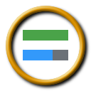
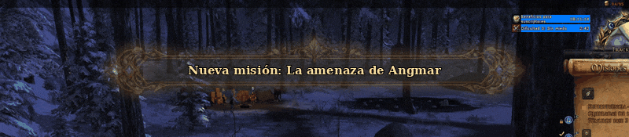
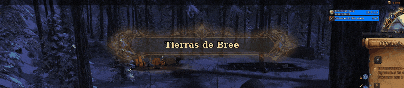
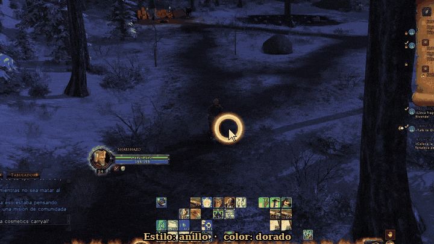
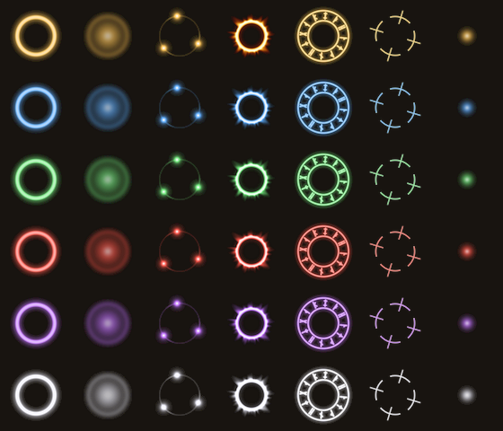
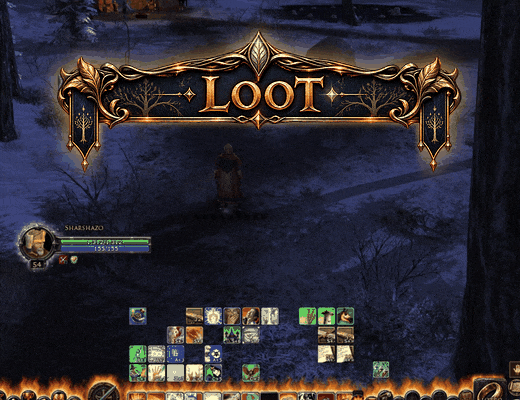
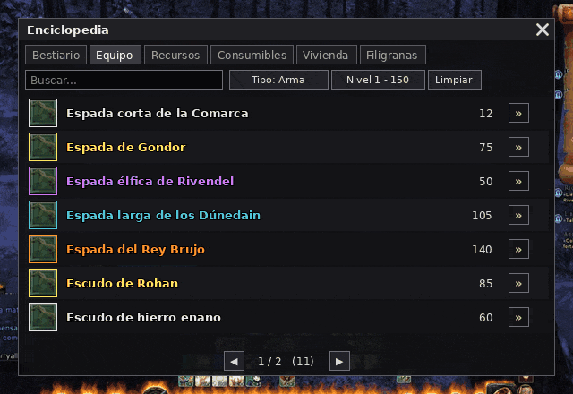

# ✨ LUI

Interfaz personalizada para **The Lord of the Rings Online**: marcos de combate más limpios, texto y bordes nítidos, control total de posición, colores, fuentes, umbrales y escala — y efectos visuales en español hechos a medida.

---

## 1. Cartel al aceptar o completar una misión

Cada vez que **aceptas** o **completas** una misión aparece arriba de la pantalla un **cartel animado con el nombre de la misión**.

- El **estilo del cartel cambia según la región** de la misión: general, Comarca, élfico, Arnor, hielo, sombra, enano, Rohan, Gondor, tierras salvajes y sur (11 estilos).
- El cartel **se alarga** según el largo del nombre, sin deformar los adornos.
- Tiene **aura**, **destello** que lo recorre y **chispas** que titilan en las gemas.
- Si aceptas varias misiones seguidas, los carteles **hacen cola** y salen uno tras otro.

---

## 2. Cartel al entrar en una zona

Al entrar en una zona nueva aparece su **nombre en un cartel con el estilo de su región**, con la misma animación (aura, destello y chispas), y desaparece suavemente.

---

## 3. Auras del puntero del ratón

El puntero lleva un **efecto animado** para no perderlo nunca en combate:

- **7 estilos**: anillo, esferas, estela, fuego, halo, mira y runas.
- **6 colores**: dorado, azul, verde, rojo, morado y blanco.
- **3 tamaños**.
- La **estela** deja un rastro de luz detrás del ratón; si **agitas** el ratón (opcional) sale un destello grande para encontrarlo al instante.
- No cambia la flecha del juego ni toma los clics: es solo el efecto.

---

## 4. Ventana de botín

Cada objeto que recoges entra en la **ventana de botín** con su icono, su nombre en el **color de su calidad** (común, poco común, raro, incomparable, legendario) y la cantidad.

- Encima va el **cartel "LOOT"** con su **halo dorado que respira**, un **destello** que cruza la palabra cada pocos segundos y **chispas** en los rombos y puntas.
- Las filas aparecen una tras otra y se desvanecen solas.

---

## 5. Marcos de grupo (party)

Marcos propios para tu **grupo de hasta 6**:

- **Barra de moral** que cambia de color según la vida (verde → amarillo → rojo) y **barra de poder** debajo, con nombre y porcentaje.
- **Aura dorada que late** alrededor del compañero que tienes **seleccionado**.
- **Aviso de vida baja**: el marco del compañero en peligro **late en rojo** para curarlo a tiempo.
- Estados **Muerto** y **Desconectado** bien visibles.

---

## 6. Marcos de incursión (raid)

Para incursiones de **12 o 24 jugadores**, ordenados **por grupos en columnas**, con las mismas barras, el aura del seleccionado y el aviso de vida baja. La disposición (filas, columnas, colores por grupo) se configura en `/lui config`.

---

## 7. Buscador de objetos (Enciclopedia)

Ventana para **buscar cualquier objeto del juego** y ver su información:

- Pestañas: **Bestiario, Equipo, Recursos, Consumibles, Vivienda y Filigranas**.
- **Búsqueda mientras escribes** (espacio = Y, `|` = O, comillas = frase exacta).
- Filtros por **tipo** y **rango de nivel**, botón **Limpiar** y páginas.
- Cada resultado con su icono, nombre en el **color de su calidad** y nivel; al elegirlo se abre su **ficha** (estadísticas, dónde se obtiene) y un enlace al **bestiario** para ver qué monstruo lo suelta.

---

## 8. Más herramientas

- Marcos de **vida y poder** del jugador, objetivo, jefe, **grupo e incursión**, y objetivo del objetivo.
- **Beneficios y perjuicios** en los marcos, barras de **efectos que expiran**, y **enfriamientos** con umbrales y listas.
- **Inventario** propio (opcional) y ventana de **bienes** de todos tus personajes.
- **Artesanía**: buscador de recetas, favoritos, ingredientes paso a paso y planes por personaje.
- **Barra de estado**: hora, espacio de inventario, dinero, accesos de artesanía y recursos.
- **Enciclopedia**: bestiario, equipo, recursos, consumibles, vivienda y tracerías.
- **Perfiles** por personaje, configuración inicial rápida y modo mover con cuadrícula. Todo se configura con `/lui config`.
