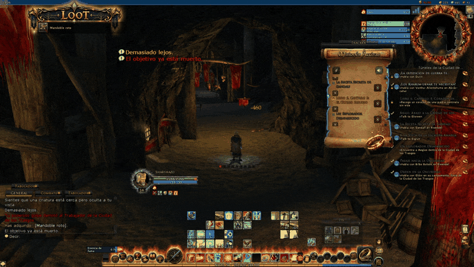

# Addons de LOTRO en español

Colección de addons para **The Lord of the Rings Online** en español, pensados para funcionar juntos: un mapa del mundo interactivo, una interfaz con efectos animados, un asistente de misiones traducido y un seguimiento de hazañas. Cada carpeta ya tiene el **nombre exacto** que el juego necesita.

> Las animaciones de este README y de los README de cada addon son **recreaciones hechas con los gráficos reales de cada addon**. Las imágenes llamadas `captura_*` son **capturas del juego**.

---

## Los addons

### 🗺️ Mapa del Mundo — [`WorldMap_Addon`](WorldMap_Addon/README.md)

<a href="WorldMap_Addon/README.md"></a>

Las 59 zonas de la Tierra Media en español, con nivel y expansión, mapas de zona con iconos y filtros, mazmorras con jefes, tus misiones activas y tus hazañas marcadas en vivo. Comando `/mapa`.
**[Ver todas las funciones →](WorldMap_Addon/README.md)**

### ✨ LUI — [`LUI`](LUI/README.md)

<a href="LUI/README.md"></a>

La interfaz LUI de Geldahr en español, con carteles animados de misión y de zona, aura del puntero, ventana de botín con cartel «LOOT» y auras en los marcos de grupo e incursión.
**[Ver todas las funciones →](LUI/README.md)**

### 📖 QuestSync — [`LOTRO_Quest_Assistant`](LOTRO_Quest_Assistant/README.md)

<a href="LOTRO_Quest_Assistant/README.md"></a>

Asistente de misiones con más de 14.000 misiones traducidas (nombre, diálogo y objetivos), tracker flotante, libro de misión, buscador, mapa y rutas, recolección y narración por voz.
**[Ver todas las funciones →](LOTRO_Quest_Assistant/README.md)**

### 🏆 Deed Tracker — [`CubePlugins/DeedTracker`](CubePlugins/DeedTracker/README.md)

<a href="CubePlugins/DeedTracker/README.md"></a>

El seguimiento de hazañas de Cube en español, con página «Por zona» y sincronizado con el Mapa del Mundo.
**[Ver todas las funciones →](CubePlugins/DeedTracker/README.md)**

---

## Qué hay en cada carpeta

| Carpeta | Qué es | Nombre en Opciones → Plugins |
|---|---|---|
| `WorldMap_Addon` | Mapa del Mundo | Mapa del Mundo |
| `LUI` | Interfaz LUI (de Geldahr, MPL-2.0) en español | LUI |
| `LOTRO_Quest_Assistant` | QuestSync: asistente de misiones en español | QuestSync |
| `CubePlugins` | Deed Tracker: seguimiento de hazañas | Deed Tracker |
| `Turbine` | Librería que necesitan QuestSync y el Mapa del Mundo | (no se activa, solo se copia) |

---

## Instalación rápida

1. Botón verde **Code → Download ZIP**.
2. Abre el ZIP. Dentro hay una sola carpeta (`Plugins-main`). Entra en ella.
3. Copia las **5 carpetas** que hay dentro (`LOTRO_Quest_Assistant`, `LUI`, `WorldMap_Addon`, `Turbine`, `CubePlugins`) y pégalas en:

   ```
   Documentos\The Lord of the Rings Online\Plugins\
   ```

   (con OneDrive: `OneDrive\Documentos\The Lord of the Rings Online\Plugins\`).
   Si Windows pregunta, acepta **combinar** carpetas y **reemplazar** archivos.

   **No copies la carpeta `Plugins-main` entera**, solo las 5 de dentro. Debe quedar, por ejemplo:

   ```
   Plugins\LUI\LUI.plugin
   Plugins\LOTRO_Quest_Assistant\QuestSync.plugin
   Plugins\WorldMap_Addon\MapaDelMundo.plugin
   Plugins\CubePlugins\DeedTracker.plugin
   Plugins\Turbine\Class.lua
   ```

4. Abre LOTRO → **Opciones → Plugins** (o `/pluginmanager` en el chat) y activa los que quieras.

---

## Cómo se conectan

- **Mapa del Mundo ↔ QuestSync:** el mapa marca tus misiones activas con flechas y auras y se actualiza al aceptar, completar o abandonar.
- **Mapa del Mundo ↔ Deed Tracker:** las hazañas de cada zona están sincronizadas en los dos sentidos y se ven en el mapa (activas con aura, completadas en gris).
- **QuestSync ↔ Deed Tracker:** comparten la lectura del chat; el tracker muestra las hazañas en curso.
- **LUI ↔ QuestSync:** el cartel de misiones de LUI usa los mismos avisos del chat.

Cada addon funciona también solo.

---

## Problemas comunes

- **`Unable to resolve package ...`**: la carpeta quedó con otro nombre o dentro de otra carpeta. Revisa que quede como en el paso 3.
- **`attempt to call global 'class' (a nil value)`**: falta la carpeta `Turbine` dentro de `Plugins`.

---

## Narración por voz (opcional)

Los botones «Narrar» de QuestSync necesitan el programa [Narrador_IA](https://github.com/sharshazo/Narrador_IA), que se instala aparte (LOTRO no deja que un addon reproduzca sonido).

---

## Licencias

`LUI` es un trabajo derivado del [LUI original de Geldahr](https://github.com/Geldahr/LUI) bajo licencia MPL-2.0 (ver `LUI/LICENSE` y `LUI/ATTRIBUTIONS.md`).
Deed Tracker está basado en el addon original de Cube.
