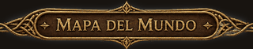
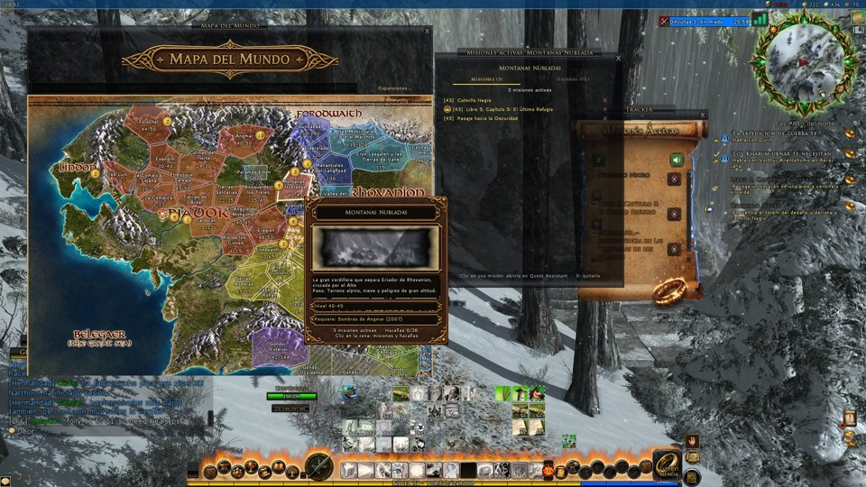
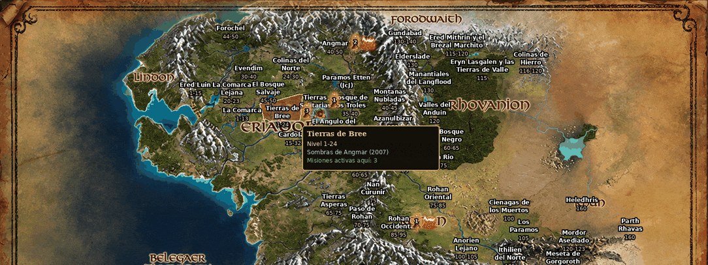
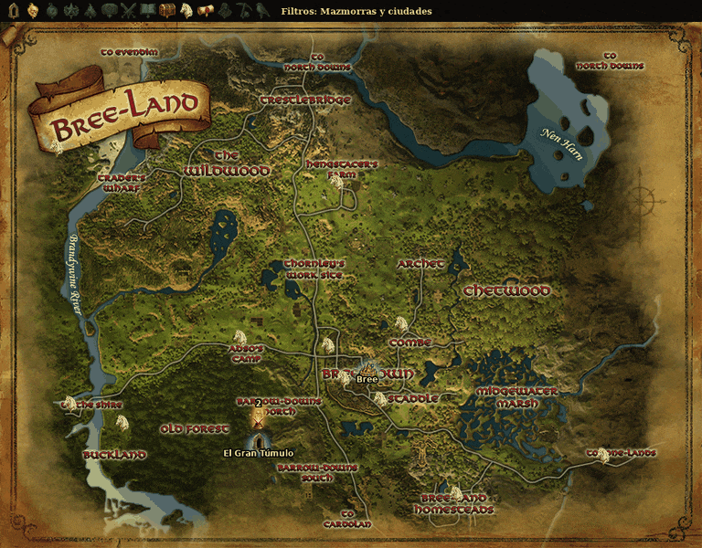
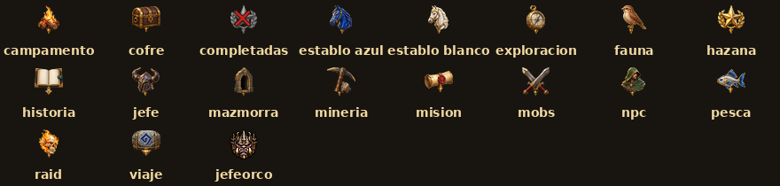
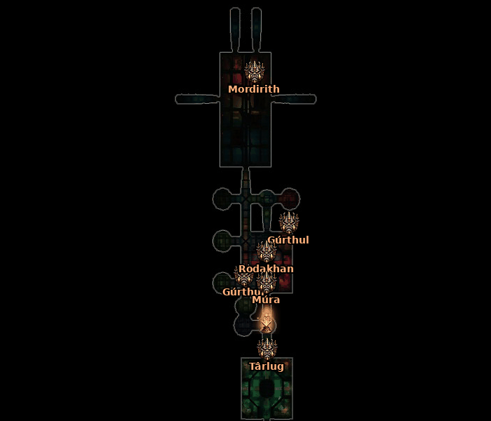
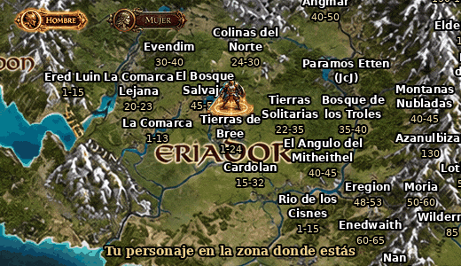

# 🗺️ Mapa del Mundo (WorldMap_Addon)

Mapa del mundo interactivo para **The Lord of the Rings Online**, en **español e inglés**, que se conecta con **QuestSync (Quest Assistant)** y **Deed Tracker** para mostrar en el mapa, en vivo, tus misiones activas, tus hazañas y los lugares importantes de cada zona.

---

## 1. El continente completo, zona por zona

El mapa muestra toda la Tierra Media (Eriador, Rhovanion, Rohan, Gondor, Mordor, Harad…) con **cada zona dibujada con su forma real**, su **nombre en español** y su **rango de nivel** debajo.

- Al pasar el ratón por una zona, se **ilumina con su color** y aparece una ficha con su nombre, nivel y expansión.
- Al hacer clic se abre el **mapa detallado de esa zona**.
- **Tus misiones activas aparecen en el mapa de forma dinámica**: junto al nombre de cada zona donde tienes misiones sale una **flecha dorada animada con el número de misiones**, y si tienes misiones en una **mazmorra** (puerta con aura) o una **incursión** (calavera con fuego), aparecen también con su animación.
- Los marcadores se actualizan solos al aceptar, avanzar o completar misiones (datos de QuestSync).

---

## 2. Mapa de cada zona con sus iconos

Dentro de cada zona aparecen los lugares importantes en su **posición exacta del juego**:

| Icono | Qué marca |
|---|---|
| 🏰 Ciudad | Ciudades y pueblos, con aura |
| 🚪 Mazmorra / 💀 Incursión | Entradas; **con aura y flecha animada si tienes misiones en ellas** |
| 🧭 Exploración | Puntos de exploración de las hazañas |
| 📜 Hazañas | Objetivos de hazañas: **con aura las activas**, **en gris con X las completadas** |
| ⛺ Campamentos, 🐎 Establos, ✈️ Viaje | Campamentos, establos blancos y de largo alcance, puntos de viaje |
| ⚔️ Matar monstruos, 📖 Historia, 🐾 Fauna, ⛏️ Minería, 🎣 Pesca, 🧑 NPC, 💰 Cofres | Cada uno con su filtro |

- **Barra de filtros** arriba del mapa (y un panel completo): cada tipo de icono se enciende o se apaga con un clic. La elección **se guarda** entre sesiones.
- Al pasar el ratón sobre un icono sale su ficha en español (e inglés), con su estado y progreso.

---

## 3. Mazmorras e incursiones: mapa interior y jefes

- Clic en una mazmorra o incursión → se abre **su mapa interior** (todas sus plantas, con ◀ ▶ para cambiar).
- **Ficha a color**: partes, niveles, número de jugadores y **"Misiones activas aquí"** con el nombre de cada una.
- **Jefes con nombre** marcados con su icono y su nombre en español en su sala.
- Si una misión activa pide **matar a un jefe**, una **flecha animada lo señala** en el mapa.

---

## 4. Tu personaje en el mapa

Con los botones **Hombre / Mujer** eliges la figura de tu personaje (guerrero o guerrera). La figura aparece **en la zona donde estás**, con su **anillo de luz animado** (naranja o rosa) bajo los pies.

---

## 5. Auras y animaciones

Todas las marcas del mapa tienen **auras animadas** (misiones, flechas, mazmorras, incursiones, ciudades, cofres, establos…), hechas para que se vean bien sobre el arte del mapa sin tapar los nombres.

---

## 6. Conexión con otros addons

- **QuestSync (Quest Assistant)**: lee tus misiones **activas y completadas**, sus objetivos en español y sus lugares.
- **Deed Tracker**: lee el **progreso de tus hazañas**; las activas brillan y las completadas se ocultan o se ven en gris.
- Si un addon no está cargado, el mapa sigue funcionando igual, solo sin esos datos.
